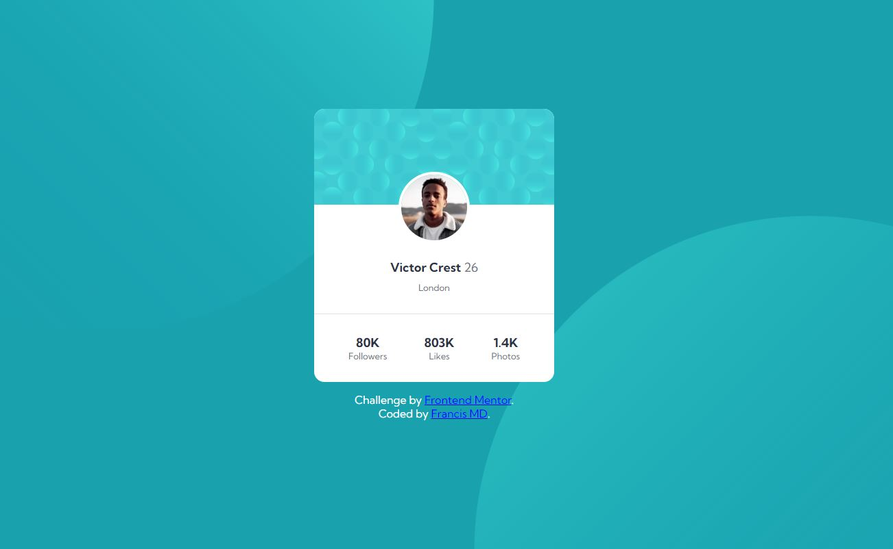
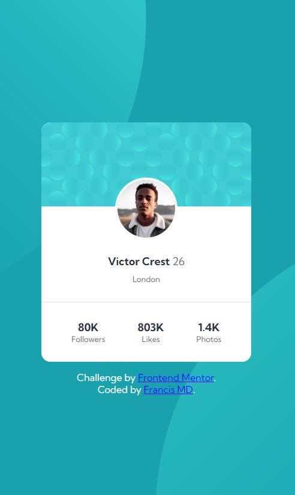

# Frontend Mentor - Profile card component solution

This is a solution to the [Profile card component challenge on Frontend Mentor](https://www.frontendmentor.io/challenges/profile-card-component-cfArpWshJ). Frontend Mentor challenges help you improve your coding skills by building realistic projects. 

## Table of contents

  - [The challenge](#the-challenge)
  - [Screenshot](#screenshot)
  - [Links](#links)
- [My process](#my-process)
  - [Built with](#built-with)
  - [What I learned](#what-i-learned)
  - [Author](#author)

### The challenge

- Build Profile card component from the designs provided

### Screenshot




### Links

- Solution URL: [Add solution URL here](https://your-solution-url.com)
- Live Site URL: https://francis-md.github.io/Profile-Card-Component/

## My process

- To build the structure with HTML5 
- Layout customization with CSS properties

### Built with

- Semantic HTML5 markup
- CSS custom properties

### What I learned

- CSS Units: vh, vw, vmin, vmax

```html
<h2>Victor Crest <span>26</span></h2>
```
```css
.proud-of-this-css {
  background-position: right 50vw bottom 40vh,
        left 53vw top 44vh;
}
```

## Author

- Website - [Francis MD](https://www.your-site.com)
- Frontend Mentor - [@Francis-MD](https://www.frontendmentor.io/profile/Francis-MD)
- Twitter - [@Francis_MD_](https://twitter.com/Francis_MD_)